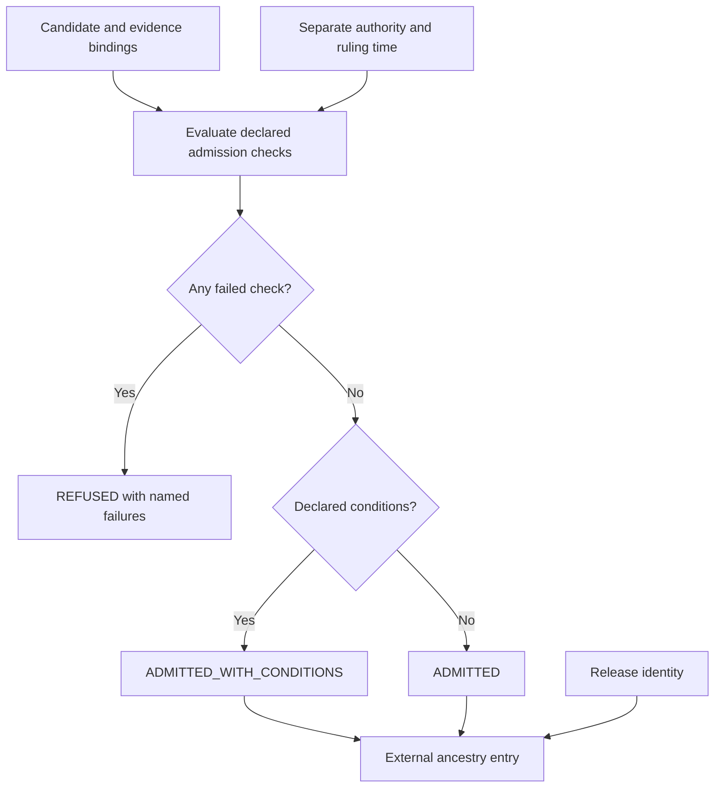
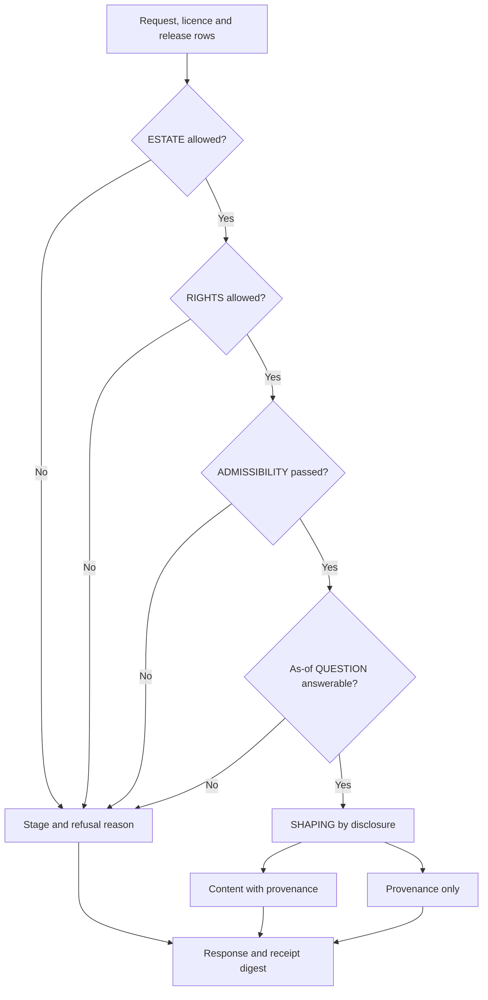

# Evidence and State Management in the instrumentation stack

Notation Systems develops computational instrumentation and evidence infrastructure for industrial and cyber-physical systems.
This component owns **evidence retention, state admission and release**. The [stack map](https://github.com/giasonpooni/Computational-Instrumentation-Workbench/blob/main/docs/STACK.md) locates all public components and distinguishes implemented paths from specifications and scaffolds.

## Current boundary

| Property | Scope |
| --- | --- |
| Implementation | Executable local rails and bounded domain implementations; demonstration corpora |
| Workbench connection | Native CIW telemetry replay inspection and optional candidate-evidence capture through the existing content-addressed evidence seam; no canonical-state persistence adapter |
| Inputs | Source evidence, candidate records, identity/time declarations and applicable policy. |
| Outputs | Retained evidence, candidate/admission decisions, versioned domain records and governed responses within documented paths. |

Local candidate preparation, authored workspace state and canonical corpus admission remain separate. Demonstration feeds do not establish a production customer service.

[Replayed instrument candidate evidence](INSTRUMENT_CANDIDATE_EVIDENCE.md) documents
the read-only CLI and separately authorized retention API. Fresh replay and
evidence/result/verification binding permit candidate review or retention,
not world-state truth, CSE acceptance or release.

## Admission and serving diagrams

These are two implemented local domain functions. They are separate from
native CIW candidate-evidence capture and do not provide canonical-state
persistence for instrument outputs or an automatic continuation of file intake.
Solid arrows show their control flow and typed outputs. The admission figure summarizes
the candidate checks without treating a successful ruling as physical truth.

`admitInto` returns rulings and ancestry for admitting outcomes; the ancestry
joins candidate/build identities to the release outside the released record.
This pure domain function is not itself a persistence write. Conditions remain
part of an admitting ruling, and a process cannot supply its own admission
authority.

The response pipeline evaluates each row in a fixed refusal order. Later
stages cannot rescue an earlier refusal; all outcomes contribute to the
response receipt.

The receipt binds the declared request, licence terms and outcomes. It is not
an independent verification or proof of policy adequacy. Demonstration rows
fail corpus-state admissibility even when the licence permits the source.
Sources: [`admission.ts`](../src/domain/admission.ts),
[`responsePipeline.ts`](../src/domain/responsePipeline.ts), and
[local intake](LOCAL_EVIDENCE_INTAKE.md). [Diagram atlas](https://github.com/giasonpooni/Computational-Instrumentation-Workbench/blob/main/docs/DIAGRAMS.md).

## Interoperability

Integrations use the component's documented contract and an explicit adapter. They preserve source observations, ordered quantities, units, coordinate/frame meaning, time semantics, missingness and declared uncertainty where applicable. An unimplemented field or conversion must be reported as unsupported rather than silently inferred.

Evidence identity names the source record; operation identity names the versioned computation; execution identity names an invocation; result identity names its output; verification identity names a scoped check. These are integration requirements, not a claim that every standalone repository already implements all five record types.

Display names and repository locations do not rename packages, schemas, operation IDs, retained corpus keys or historical runtime pins. CIW integrations use the exact source revisions named in its runtime manifests and operating guides; a provider's current default branch is not a substitute for that binding. Published numerical records retain their original run scope.

## Technical references

- [Overview and runnable instructions](../README.md)
- [docs/COMPANY_MANDATE.md](COMPANY_MANDATE.md)
- [docs/LOCAL_EVIDENCE_INTAKE.md](LOCAL_EVIDENCE_INTAKE.md)
- [docs/ARCHITECTURE.md](ARCHITECTURE.md)

Private customer state, deployment configuration and calibration knowledge are outside this public component description. Applicable repository licenses and source-data rights remain controlling; a shared stack identity is not a license grant or a change of repository visibility.
